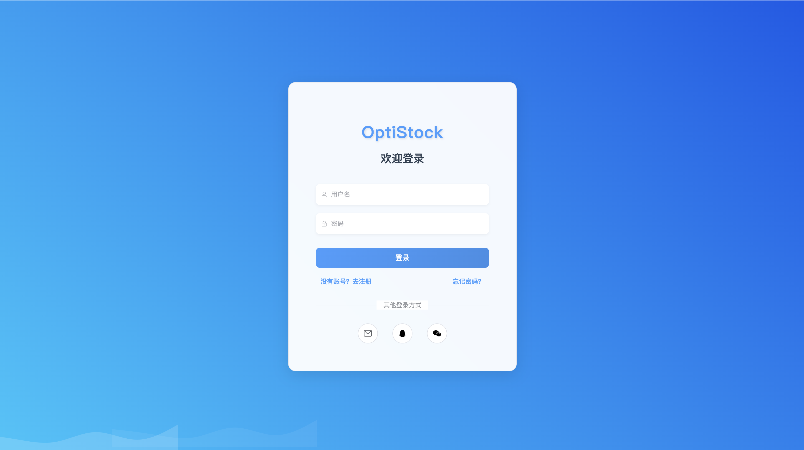
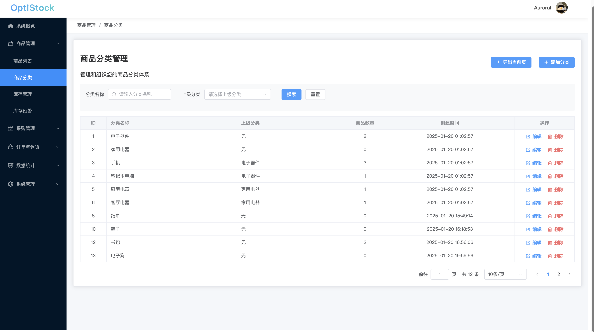
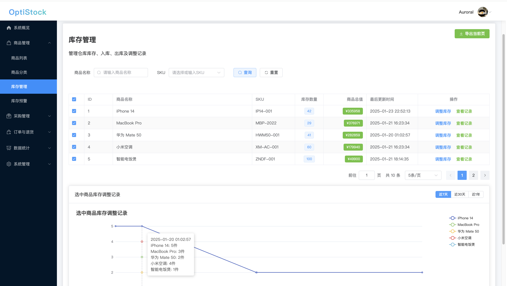
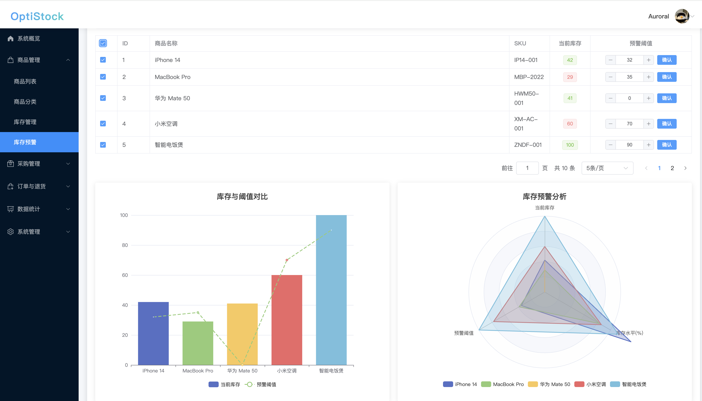
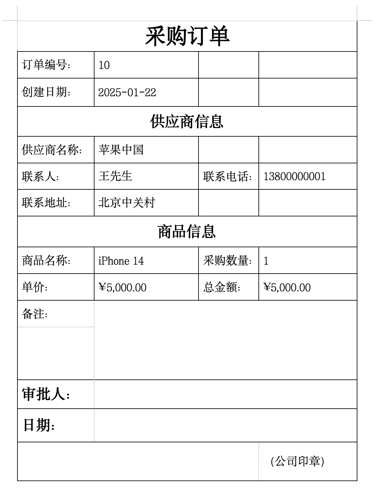
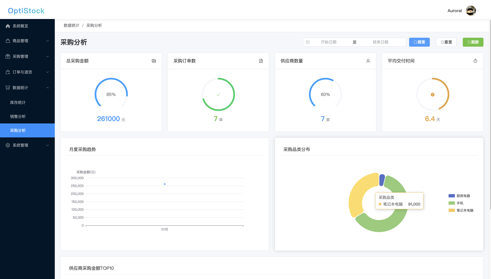
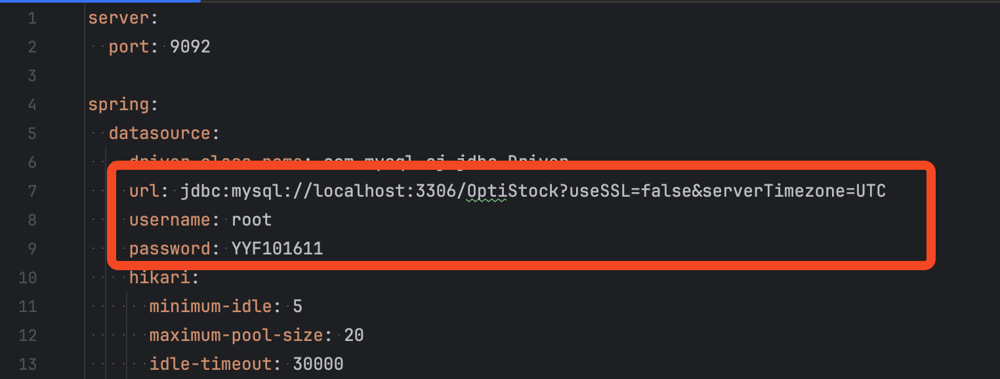

# OptiStock 智能仓储管理系统 🏭

> OptiStock 是一款现代化、智能化的仓储管理系统,采用 Vue 3 + Spring Boot 技术栈打造。系统提供直观的可视化界面,强大的库存管理功能,帮助企业实现高效的仓储运营。

## ✨ 核心特色

### 👥 用户体系
- 多样化登录体验
  - 账号密码 / 手机验证码 / 第三方快捷登录
  - 安全可靠的密码重置机制
- 个性化信息管理
  - 基于阿里云 OSS 的头像存储
  - 完善的个人资料维护

### 📦 商品管理
- 灵活的分类体系
  - 支持多级树形分类结构
  - 便捷的分类维护
- 高效的商品管理
  - 完整的商品信息维护
  - 批量导入导出功能
  - 智能的库存关联机制

### 📊 库存管理
- 实时监控预警
  - 库存动态实时掌控
  - 自定义预警阈值
  - 及时预警通知
- 智能分析决策
  - 可视化库存趋势
  - 详细的出入库记录
  - 智能库存优化建议

### 📋 订单管理
- 全渠道订单整合
  - 支持主流电商平台
  - 统一订单处理流程
- 完整订单生命周期
  - 订单状态实时追踪
  - 灵活的订单处理
  - 多格式数据导出

### 🛒 采购管理
- 供应链协同
  - 供应商档案管理
  - 采购流程规范化
- 智能采购决策
  - 多级审批流程
  - 采购数据分析
  - 供应商评估体系

### 📈 数据可视化
- 实时监控大屏
  - 库存状态实时展示
  - 关键指标动态监控
  - 异常情况及时预警
- 多维度分析
  - 库存趋势分析
  - 销售数据洞察
  - 采购效率评估
  - 供应商绩效分析
## 🌐 在线体验

> 🎯 快速开始使用系统

||  |
|------|------|
| 体验地址 | [http://yyf040810.cn](http://yyf040810.cn) |
| 测试账号 | `Luck_ff0810` |
| 测试密码 | `123456` |

> 👋 欢迎访问体验,如有问题请及时反馈

## 效果展示
### 主界面


### 登录与用户管理
- 安全的登录界面，支持用户名密码认证
- 完善的个人信息管理模块



### 商品与分类管理
- 详细的商品信息维护界面，实现对商品的编辑、删除、导出，以及分类的管理




### 库存监控
- 实时库存状态展示
- 库存预警及分析




### 采购管理
- 规范化的采购流程
- 供应商管理与评估





### 订单处理
- 多渠道订单统一管理
- 订单状态全程追踪


### 数据分析
- 多维度数据可视化展示
- 智能分析报表




### 个人信息维护
- 基于阿里云 OSS 的头像存储
- 完善的个人资料维护
- 密码重置


### 配置说明



## 🛠️ 技术架构

### 🎨 前端技术栈
- ⚡️ Vue 3 - 渐进式JavaScript框架
- 🚀 Vite - 下一代前端构建工具
- 🎯 Element Plus - 优雅的Vue 3组件库
- 📦 Pinia - 直观的状态管理方案
- 🛣️ Vue Router - 官方路由管理器
- 📊 ECharts - 强大的数据可视化库
- 🌐 Axios - 优秀的HTTP客户端

### ⚙️ 后端技术栈
- 🍃 Spring Boot 3.1.3 - 企业级应用开发框架
- ⚡️ MyBatis-Plus 3.5.3.1 - 增强的ORM框架
- 🗄️ MySQL 8.0 - 可靠的关系型数据库
- 🚀 Redis - 高性能缓存数据库
- 🔐 JWT - 安全的身份认证机制
- ☁️ 阿里云OSS - 稳定的云存储服务
- 🛠️ Lombok - 优雅的代码简化工具

## 🚀 快速开始

### 🔧 环境要求
- ☕️ JDK 17+
- 📦 Node.js 16+
- 🗄️ MySQL 8.0+
- 🚀 Redis 6.0+

### 后端环境配置
1. 执行下面命令克隆项目到本地
```bash
git clone https://github.com/Auroral0810/OptiStock.git
```
2.导入数据库文件
在项目目录下，找到OptiStock/sql/OptiStock.sql文件，导入到本地数据库

3.cd到项目目录，并进入后端配置文件下的application.yml文件
```bash
cd OptiStock/OptiStock_backend
```
4. 配置数据库

```yaml
# application.yml
spring:
  datasource:
    url: jdbc:mysql://localhost:3306/optistock?serverTimezone=Asia/Shanghai
    username: your_username #你的数据库用户名
    password: your_password #你的数据库密码
```

5. 配置 Redis（确保Redis已安装和运行，在命令行输入redis-server启动）
```yaml
spring:
  redis:
    host: localhost
    port: 6379 #Redis端口
```

4. 配置阿里云 OSS（用于上传头像，也可以选择其他方式进行平替）
```yaml
aliyun:
  oss:
    endpoint: your-endpoint #阿里云OSS的endpoint
    accessKeyId: your-access-key-id #阿里云OSS的accessKeyId
    accessKeySecret: your-access-key-secret #阿里云OSS的accessKeySecret
    bucketName: your-bucket-name #阿里云OSS的bucketName
```

5. 运行后端项目
```bash
mvn spring-boot:run
```
**如图所示，后端项目就正确运行了**

### 前端配置
1. 项目目录下进入前端目录
```bash
cd OptiStock_frontend
```
2. 安装依赖
```bash
npm install
```
3. 启动开发服务器
```bash
npm run dev
```
输出结果如图所示则说明前端项目启动成功，项目运行在http://localhost:5173/
/Users/auroral/Desktop/SCR-20250123-ufsx.png
4. 构建生产版本
```bash
npm run build
```

## 项目结构
```
OptiStock/
├── OptiStock_backend/       # 后端项目目录
│   ├── src/
│   │   ├── main/
│   │   │   ├── java/com/auroral/  # Java源代码目录
│   │   │   │   ├── config/        # 配置类
│   │   │   │   ├── controller/    # 控制器
│   │   │   │   ├── dto/           # 数据传输对象
│   │   │   │   ├── entity/        # 实体类
│   │   │   │   ├── enums/         # 枚举类
│   │   │   │   ├── interceptor/   # 拦截器
│   │   │   │   ├── mapper/        # MyBatis Mapper接口
│   │   │   │   ├── service/       # 业务逻辑处理
│   │   │   │   ├── utils/         # 工具类
│   │   │   │   └── vo/            # 视图对象
│   │   │   └── resources/         # 资源文件
│   │   │       ├── application.yml  # 应用配置文件
│   │   │       ├── mapper/          # MyBatis映射文件
│   │   │       └── mybatis-config.xml  # MyBatis配置文件
│   ├── pom.xml                             # Maven构建配置
│   └── 后端接口测试/                        # 后端接口测试文件
│
├── OptiStock_frontend/       # 前端项目目录
│   ├── src/
│   │   ├── api/              # API接口
│   │   ├── assets/           # 静态资源
│   │   ├── components/       # 组件
│   │   ├── router/           # 路由配置
│   │   ├── stores/           # Pinia状态管理
│   │   ├── views/            # 页面视图
│   │   ├── main.js           # 主入口文件
│   │   └── utils/            # 工具类
│   ├── public/               # 公共静态资源
│   ├── package.json          # 项目依赖配置
│   ├── package-lock.json     # 依赖锁定文件
│   └── vite.config.js        # Vite配置文件
│
├── sql/                      # 数据库相关文件
│   ├── OptiStock.sql          # 数据库初始化SQL
├── README.md                  # 项目说明文档

```

## 🚀 未来规划

<table>
<tr>
  <td>
    <h3>🔐 认证与安全</h3>
    <ul>
      <li>[1] 集成主流社交平台登录
        <ul>
          <li>微信扫码/小程序登录</li>
          <li>QQ一键登录</li>
        </ul>
      </li>
      <li>[2] 多重身份验证找回密码
        <ul>
          <li>手机短信验证</li>
          <li>邮箱验证码</li>
        </ul>
      </li>
    </ul>
  </td>
  <td>
    <h3>🤖 AI 智能化</h3>
    <ul>
      <li>[3] 智能数据分析平台
        <ul>
          <li>接入主流大语言模型</li>
          <li>多维度数据可视化</li>
        </ul>
      </li>
      <li>[4] 智能投顾系统
        <ul>
          <li>个性化投资建议</li>
          <li>实时风险预警</li>
        </ul>
      </li>
    </ul>
  </td>
</tr>
<tr>
  <td>
    <h3>⚡ 性能优化</h3>
    <ul>
      <li>[5] 分布式缓存架构
        <ul>
          <li>Redis集群部署</li>
          <li>多级缓存策略</li>
        </ul>
      </li>
      <li>[6] 系统性能提升
        <ul>
          <li>代码重构优化</li>
          <li>数据库性能调优</li>
        </ul>
      </li>
    </ul>
  </td>
  <td>
    <h3>✨ 用户体验</h3>
    <ul>
      <li>[7] UI/UX升级
        <ul>
          <li>现代化界面设计</li>
          <li>流畅交互动效</li>
        </ul>
      </li>
      <li>[8] 性能体验优化
        <ul>
          <li>首屏加载优化</li>
          <li>操作响应提升</li>
        </ul>
      </li>
    </ul>
  </td>
</tr>
</table>

---

## 贡献指南 🤝
我们非常欢迎您的贡献！如果您有任何想法或建议:
- 提交 Issue 来描述问题或新功能
- 提交 Pull Request 来改进代码
- 参与讨论以帮助项目变得更好

## 许可证 📄
本项目采用 [MIT 许可证](LICENSE)。

## 联系方式 📬
> 如果您有任何问题或建议，欢迎联系我：

| 联系方式 | 详情 |
|---------|------|
| 作者 | 俞云烽 |
| QQ | 1957689514 |
| 邮箱 | 15968588744@163.com |
